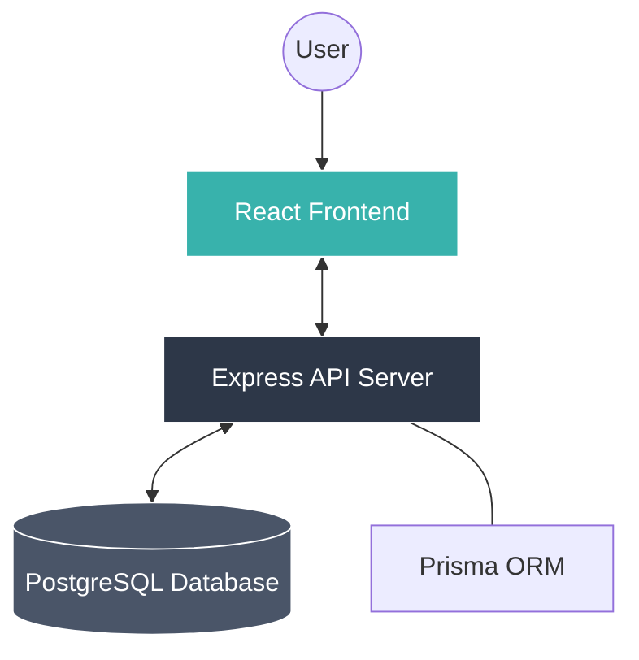
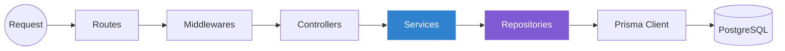
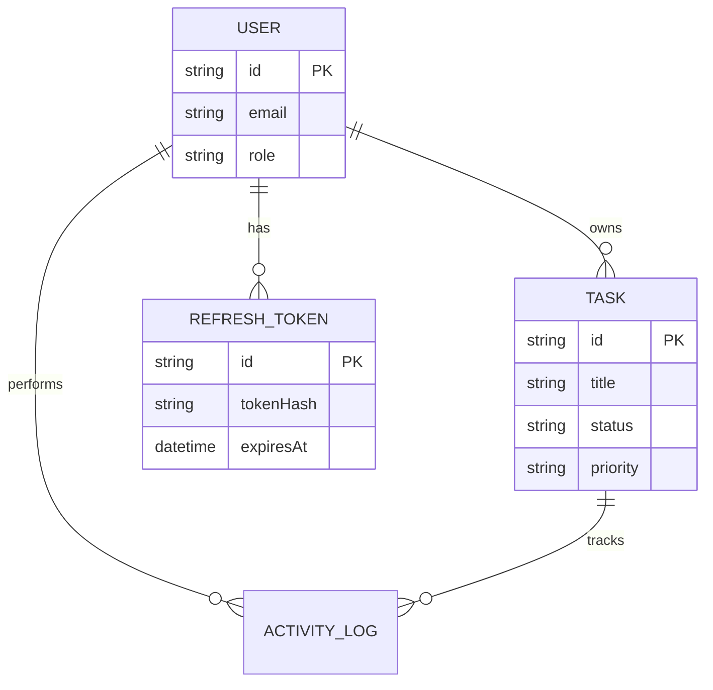

# PrimeGuard

[](https://nodejs.org/)
[](https://reactjs.org/)
[](https://www.prisma.io/)
[](https://tailwindcss.com/)
[](https://opensource.org/licenses/MIT)

PrimeGuard is a production-grade, full-stack task management platform designed with scalability, security, and clean architecture in mind. Built as a monorepo, it features a robust Node.js/Express backend and a modern React frontend.

---

##  Key Features

### Core Task Management
- **Full CRUD Operations**: Create, view, update, and soft-delete tasks.
- **Advanced Filtering & Sorting**: Filter tasks by status, priority, and search by title/description.
- **Pagination**: Efficient data loading for large task lists.
- **Priority Levels**: Categorize tasks as Low, Medium, or High.

### Enterprise-Grade Security
- **JWT Authentication**: Secure access using short-lived access tokens and long-lived refresh tokens.
- **Token Rotation**: Advanced refresh token rotation logic for enhanced security and protection against replay attacks.
- **Role-Based Access Control (RBAC)**: Distinct permissions for `USER` and `ADMIN` roles.
- **Security Headers**: Integrated `Helmet` for setting various security-related HTTP headers.
- **Rate Limiting**: Protection against Brute Force and DoS attacks on both Auth and API routes.

### Logging & Observability
- **Comprehensive Activity Logs**: Tracking user actions like login, logout, profile updates, and task modifications.
- **Structured Logging**: Using `Winston` with daily log rotation for backend monitoring.
- **Swagger Documentation**: Interactive API documentation available at `/docs`.

---

##  Technical Architecture

### Monorepo Structure
- **`apps/api`**: Node.js & Express server written in TypeScript. Follows a Repository/Service pattern for clean separation of concerns.
- **`apps/web`**: React application using Vite, Axios, and Tailwind CSS.
- **`docs`**: Project documentation and assets.

### Tech Stack
- **Backend**: Node.js, Express, TypeScript, PostgreSQL, Prisma ORM, JWT, Zod (Validation), Swagger.
- **Frontend**: React, Vite, Axios, Tailwind CSS, Lucide React (Icons).
- **Infrastructure**: Docker, Docker Compose, Nginx (for frontend production).

---

## 🗺️ Architectural Diagrams

### System Architecture


### Backend Layered Architecture


### Data Model (ERD)


---

##  Getting Started

To get the project up and running locally, please refer to our detailed **[Setup Guide](SETUP.md)**.

### Quick Start (Local)
```bash
npm install
npm run dev
```

### Quick Start (Docker)
```bash
docker compose up --build
```

---

##  Demo Credentials

If you seeded the database using `npm run prisma:seed --workspace api`, you can use the following accounts:

- **Admin Account**:
  - **Email**: `admin@primeguard`
  - **Password**: `Admin@12345`
- **User Account**:
  - **Email**: `user@primeguard`
  - **Password**: `Admin@12345`

---

##  Security Implementation Details

- **Refresh Token Rotation**: When a refresh token is used, a new pair is issued, and the old one is invalidated. If a compromised refresh token is used, the entire family is revoked.
- **Soft Delete**: Records are not permanently removed from the database; instead, they are marked with `deletedAt`, ensuring data integrity and audit trails.
- **Input Validation**: Strict schema validation using `Zod` for all request bodies and parameters.

---

##  Development Workflow

- **Linting**: `npm run lint` - Runs TypeScript compiler checks across all workspaces.
- **Formatting**: `npm run format` - Ensures consistent code style using Prettier.
- **Database Management**: `npm run prisma:studio --workspace api` - Visual database management.

---

## Developed By

### Bhavy Manchanda